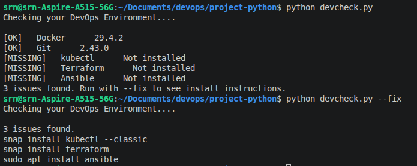

# devenv-checker 
Check your DevOps environment from the terminal.

# Demo:


# Usage:
```
python devcheck.py
python devcheck.py --fix
```

# Tools checked
- Docker
- Git
- kubectl
- Terraform
- Ansible

# Requirements
- Python 3.6+
- Linux (install instructions are linux-based)

# How to run
```
git clone https://github.com/srniraula/devenv-checker
cd devenv-checker
python devcheck.py
```

# File structure in the repo
```
devenv-checker/
├── devcheck.py
└── README.md
```

